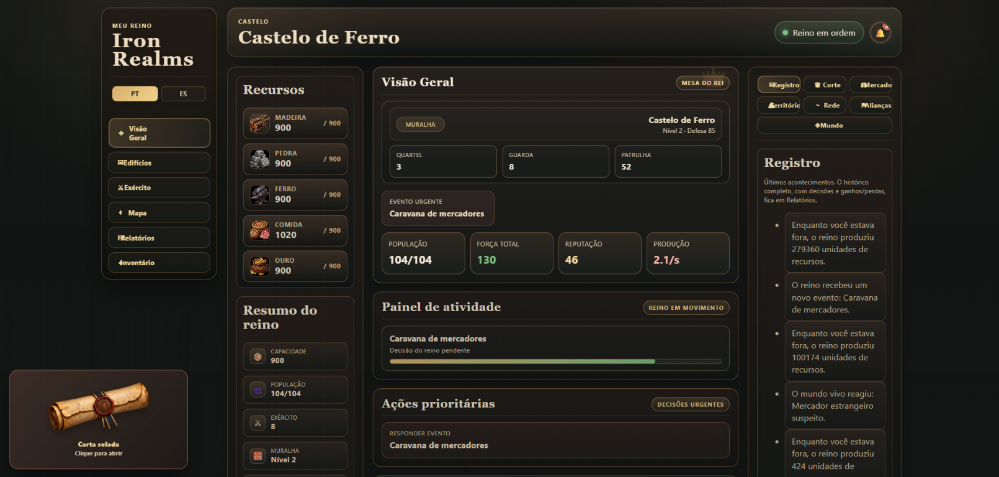
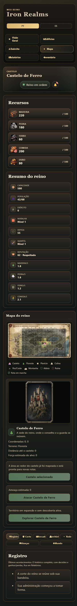
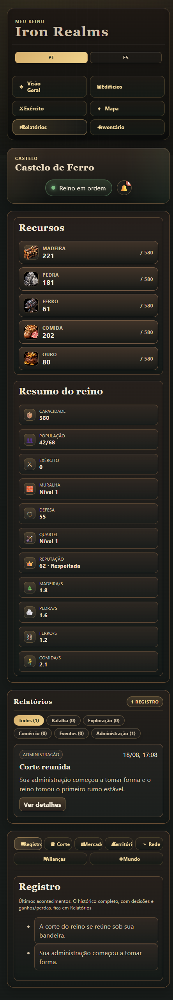

# Iron Realms

A medieval browser strategy prototype about ruling a small kingdom, keeping it alive, and deciding what kind of realm it becomes over time.

This repository is public because I want help improving the game, testing ideas, and evolving the project with other developers. It is already playable, but it is still a prototype and not a finished online game.

[Português](#português) | [English](#english) | [Español](#español)

## Screenshots

| Overview | Map | Reports |
| --- | --- | --- |
|  |  |  |

Captions: overview / visão geral / vista general · map / mapa / mapa · reports / relatórios / informes

---

## English

### What this project is

Iron Realms is a static HTML, CSS, and JavaScript strategy game. You play as the ruler of a fortress, manage resources, expand your territory, react to events, and shape the identity of the kingdom through your decisions.

The main goal of the project is not realism or competitive multiplayer yet. The goal right now is to build a strong single-player kingdom loop with atmosphere, readable UI, and systems that can grow later.

### What is already playable

- resource economy for wood, stone, iron, food, and gold
- building progression and timed construction
- military training and army strength
- 9x9 world map with travel, battles, ruins, villages, and expeditions
- local inventory with consumable items
- event and living-world choices with logs and reports
- local diplomacy, alliance, and network panels
- browser save through `localStorage`
- interface dictionaries for `pt-BR` and `es-ES`

### What is not finished yet

- there is no backend, account system, or real multiplayer
- alliance and network features are local simulations only
- there is no automated test suite yet
- long-session balance still needs proper testing
- the interface is currently available in Portuguese and Spanish; English documentation exists to help collaborators

### Project structure

```text
index.html              Interface shell
style.css               Layout and visual design
src/game-foundation.js  Shared runtime primitives
src/game-data.js        Catalogs, world data, defaults, events
src/game-state.js       Save/load, normalization, calculations
src/game-render.js      Panel rendering and UI output
src/game-actions.js     Player actions, timers, bootstrap
src/i18n.js             Language behavior
lang/                   Game text dictionaries
assets/                 Images and artwork
docs/                   Internal project notes and audits
```

### Run locally

```powershell
python -m http.server 8000
```

Then open `http://localhost:8000/`.

### Where help is most useful

- bug fixing
- gameplay balancing
- UI cleanup
- accessibility improvements
- code organization
- localization review

### License

This repository is source-available under the custom license in [LICENSE](C:/Users/MyLastYear/Documents/Iron/LICENSE).

You may study, play, share, and modify the project for personal, educational, or other non-commercial use. Commercial use requires separate written permission from the author.

---

## Português

### O que é este projeto

Iron Realms é um jogo de estratégia medieval para navegador, feito com HTML, CSS e JavaScript puro. Você joga como o governante de uma fortaleza, administra recursos, expande o território, responde a eventos e define que tipo de reino está construindo.

Hoje o foco ainda não é realismo extremo nem multiplayer competitivo. O foco é construir uma base forte de jogo solo, com atmosfera, interface legível e sistemas que possam crescer depois.

### O que já está jogável

- economia de madeira, pedra, ferro, comida e ouro
- construções com progresso e tempo de conclusão
- treinamento militar e força do exército
- mapa 9x9 com viagens, batalhas, ruínas, aldeias e expedições
- inventário local com itens consumíveis
- eventos e mundo vivo com escolhas, registro e relatórios
- painéis locais de aliança, diplomacia e rede
- save no navegador via `localStorage`
- interface em `pt-BR` e `es-ES`

### O que ainda não está pronto

- não existe backend, conta de jogador ou multiplayer real
- alianças e rede ainda são simulações locais
- ainda não existe suíte automatizada de testes
- o balanceamento de campanhas longas ainda precisa de validação
- a interface do jogo hoje está em Português e Espanhol; a documentação em Inglês existe para ajudar colaboradores

### Estrutura do projeto

```text
index.html              Estrutura principal da interface
style.css               Layout e direção visual
src/game-foundation.js  Primitivas compartilhadas do runtime
src/game-data.js        Catálogos, mundo, defaults e eventos
src/game-state.js       Save/load, normalização e cálculos
src/game-render.js      Renderização dos painéis e da UI
src/game-actions.js     Ações do jogador, timers e bootstrap
src/i18n.js             Comportamento de idioma
lang/                   Dicionários de texto do jogo
assets/                 Imagens e artes
docs/                   Notas internas e auditorias
```

### Como executar

```powershell
python -m http.server 8000
```

Depois abra `http://localhost:8000/`.

### Onde a ajuda é mais útil

- correção de bugs
- balanceamento
- limpeza de interface
- acessibilidade
- organização de código
- revisão de localização

### Licença

Este repositório usa a licença customizada em [LICENSE](C:/Users/MyLastYear/Documents/Iron/LICENSE).

Você pode estudar, jogar, compartilhar e modificar o projeto para uso pessoal, educacional ou outro uso não comercial. Uso comercial exige permissão escrita separada do autor.

---

## Español

### Qué es este proyecto

Iron Realms es un juego de estrategia medieval para navegador, hecho con HTML, CSS y JavaScript puro. Juegas como el gobernante de una fortaleza, administras recursos, expandes el territorio, respondes a eventos y defines qué clase de reino estás construyendo.

Ahora mismo el objetivo no es el realismo extremo ni el multiplayer competitivo. El objetivo es construir una base sólida de juego individual, con atmósfera, interfaz clara y sistemas que puedan crecer después.

### Lo que ya es jugable

- economía de madera, piedra, hierro, comida y oro
- edificios con progreso y tiempo de construcción
- entrenamiento militar y fuerza del ejército
- mapa 9x9 con viajes, batallas, ruinas, aldeas y expediciones
- inventario local con objetos consumibles
- eventos y mundo vivo con elecciones, registro e informes
- paneles locales de alianza, diplomacia y red
- guardado en navegador mediante `localStorage`
- interfaz en `pt-BR` y `es-ES`

### Lo que todavía no está listo

- no existe backend, cuenta de jugador ni multiplayer real
- las alianzas y la red siguen siendo simulaciones locales
- todavía no existe una suite automatizada de pruebas
- el balance de campañas largas todavía necesita validación
- la interfaz del juego hoy está en Portugués y Español; la documentación en Inglés existe para ayudar a colaboradores

### Estructura del proyecto

```text
index.html              Estructura principal de la interfaz
style.css               Layout y dirección visual
src/game-foundation.js  Primitivas compartidas del runtime
src/game-data.js        Catálogos, mundo, defaults y eventos
src/game-state.js       Guardado, normalización y cálculos
src/game-render.js      Renderizado de paneles y UI
src/game-actions.js     Acciones del jugador, timers y bootstrap
src/i18n.js             Comportamiento de idioma
lang/                   Diccionarios de texto
assets/                 Imágenes y arte
docs/                   Notas internas y auditorías
```

### Cómo ejecutarlo

```powershell
python -m http.server 8000
```

Después abre `http://localhost:8000/`.

### Dónde ayuda más colaborar

- corrección de bugs
- balance del juego
- limpieza de interfaz
- accesibilidad
- organización del código
- revisión de localización

### Licencia

Este repositorio usa la licencia personalizada incluida en [LICENSE](C:/Users/MyLastYear/Documents/Iron/LICENSE).

Puedes estudiar, jugar, compartir y modificar el proyecto para uso personal, educativo u otro uso no comercial. El uso comercial requiere permiso escrito por separado del autor.
